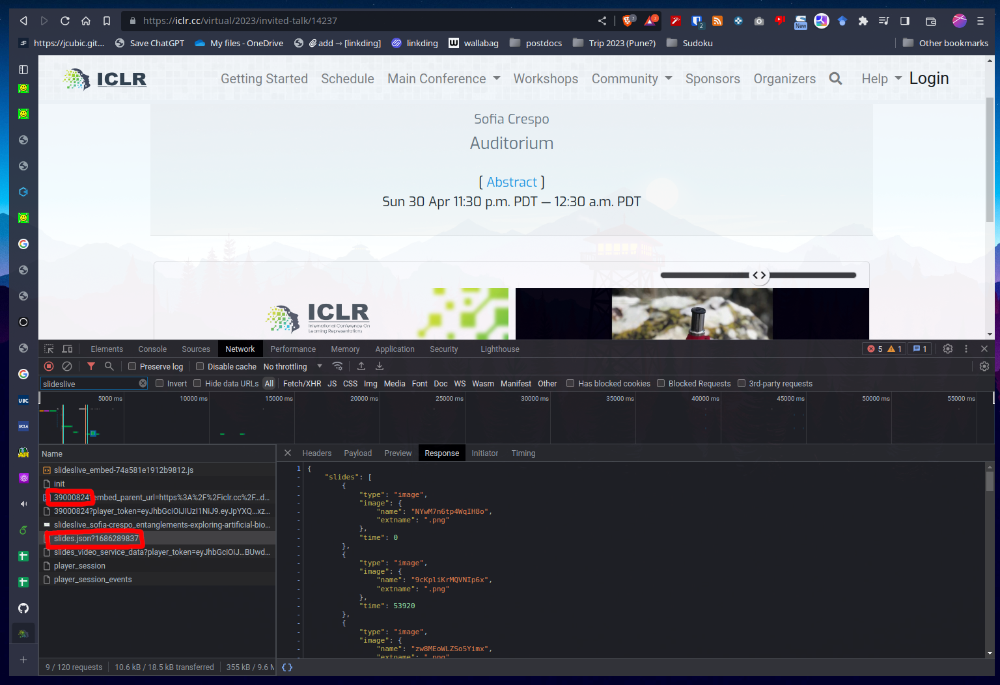

slideslive-slides-dl
====================

### Downloading private videos from miniconf conference sites (e.g. [ICLR](iclr.cc) etc.) 

Slideslive videos from the ICLR site can only be accessed from the conference site. You can use the `new_miniconf_extractor_2023.py` script for downloading from this kind of embedded video links. The input has to be a json file that the miniconf site pulls while loading the page, as shown below. Save this json as a file with name {TALK_ID}.json, e.g. 39000824.json for the example below.



### From Slideslive Link

a script to download the slides of a presentation on [slideslive.com](https://slideslive.com/).
This software only downloads slides and not the video, 
use [youtube-dl](https://youtube-dl.org) for that. Be aware of copyright law. Archival and 
education use is encouraged.


install and run
---------------

- `pip3 install -r requirements.txt`
- `python3 slideslive-slides-dl.py https://slideslive.de/38919334/technical-seo-and-modern-javascript-web-apps`


help
----

```
usage: slideslive-slides-dl.py [-h] [--size SIZE] [--useragent USERAGENT]
                               [--basedataurl BASEDATAURL]
                               [--waittime WAITTIME]
                               url

positional arguments:
  url

optional arguments:
  -h, --help            show this help message and exit
  --size SIZE           medium or big
  --useragent USERAGENT
  --basedataurl BASEDATAURL
  --waittime WAITTIME   seconds to wait after each download

```

create a video file out of slides
---------------------------------

see: https://trac.ffmpeg.org/wiki/Slideshow

- install ffmpeg

- change directory to folder with the images:
`cd 00000000-sometitle` 

- use ffmpeg to create a video:
`ffmpeg -f concat -i ffmpeg_concat.txt -vsync vfr -pix_fmt yuv420p slides-video.mp4`


license
-------

MIT License, Copyright (c) 2019 Peter Grassberger
